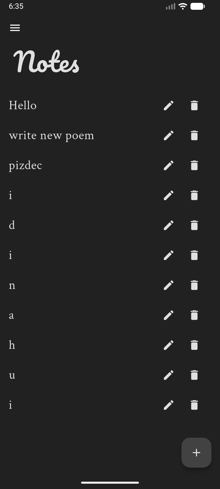

# 📝 Notes App

A sleek, minimalist Notes application built with Flutter, focusing on performance and clean typography.

## ✨ Features
* **Offline Persistence**: Your notes and theme preferences are locally stored using `SharedPreferences`, ensuring data is never lost on restart.
* **Full CRUD Support**: Effortlessly create, read, update, and delete notes through an intuitive UI.
* **Dynamic Theming**: Seamlessly switch between Light and Dark modes with instant updates powered by the `Provider` package.
* **Polished UI/UX**:
  - Beautiful typography using `Google Fonts` (Pacifico for branding, Crimson Text for readability).
  - Contextual menus for each note using the `Popover` package.
  - Custom navigation drawer with smooth transitions.
  - iOS-style `CupertinoSwitch` for theme management.

## 🛠 Tech Stack
- **Framework**: Flutter
- **State Management**: Provider
- **Local Storage**: SharedPreferences
- **Fonts**: Google Fonts
- **UI Components**: Popover, Cupertino Icons

## 🚀 Getting Started
1. Clone this repository
2. Install dependencies:
    ```bash
   flutter pub get
3. Run the app:
   ```bash
   flutter run

## 📸 Screenshots



## 😺 Cute cat


))))))))